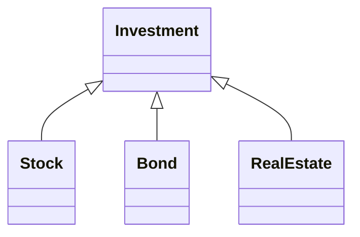

# CHAPTER 4 Smart Pointers

诗人和歌曲作家喜欢爱。有时候喜欢计数。很少情况下两者兼有。受伊丽莎白·巴雷特·勃朗宁（Elizabeth Barrett Browning）对爱和数的不同看法的启发（“我怎么爱你？”让我数一数。”）和保罗·西蒙（Paul Simon）（“离开你的爱人必须有50种方法。”），我们可以试着枚举一些为什么原始指针很难被爱的原因：

1. 它的声明不能指示所指到底是单个对象还是数组。
2. 它的声明没有告诉你用完后是否应该销毁它，即指针是否拥有所指之物。
3. 如果你决定你应该销毁对象所指，没人告诉你该用delete还是其他析构机制（比如将指针传给专门的销毁函数）。
4. 如果你发现该用delete。 原因1说了不知道是delete单个对象还是delete数组。如果用错了结果是未定义的。
5. 假设你确定了指针所指，知道销毁机制，也很难确定你在所有执行路径上都执行了销毁操作（包括异常产生后的路径）。少一条路径就会产生资源泄漏，销毁多次还会导致未定义行为。
6. 一般来说没有办法告诉你指针是否变成了悬空指针（dangling pointers），即内存中不再存在指针所指之物。悬空指针会在对象销毁后仍然指向它们。

原始指针是强大的工具，当然，另一方面几十年的经验证明，只要注意力稍有疏忽，这个强大的工具就会攻击它的主人。

智能指针是解决这些问题的一种办法。智能指针包裹原始指针，它们的行为看起来像被包裹的原始指针，但避免了原始指针的很多陷阱。你应该更倾向于智能指针而不是原始指针。几乎原始指针能做的所有事情智能指针都能做，而且出错的机会更少。

在C++11中存在四种智能指针：`std::auto_ptr`, `std::unique_ptr`, `std::shared_ptr`,` std::weak_ptr`。都是被设计用来帮助管理动态对象的生命周期，在适当的时间通过适当的方式来销毁对象，以避免出现资源泄露或者异常行为。

`std::auto_ptr`是C++98的遗留物，它是一次标准化的尝试，后来变成了C++11的`std::unique_ptr`。要正确的模拟原生指针需要移动语义，但是C++98没有这个东西。取而代之，`std::auto_ptr`拉拢拷贝操作来达到自己的移动意图。这导致了令人奇怪的代码（拷贝一个`std::auto_ptr`会将它本身设置为null！）和令人沮丧的使用限制（比如不能将`std::auto_ptr`放入容器）。

`std::unique_ptr`能做`std::auto_ptr`可以做的所有事情以及更多。它能高效完成任务，而且不会扭曲拷贝语义。在所有方面它都比`std::unique_ptr`好。现在`std::auto_ptr`唯一合法的使用场景就是代码使用C++98编译器编译。除非你有上述限制，否则你就该把`std::auto_ptr`替换为`std::unique_ptr`而且绝不回头。

各种智能指针的API有极大的不同。唯一功能性相似的可能就是默认构造函数。因为有很多关于这些API的详细手册，所以我将只关注那些API概览没有提及的内容，比如值得注意的使用场景，运行时性能分析等，掌握这些信息可以更高效的使用智能指针。


## Item 18:对于独占资源使用std::unique_ptr
当你需要一个智能指针时，`std::unique_ptr`通常是最合适的。可以合理假设，默认情况下，`std::unique_ptr`等同于原始指针，而且对于大多数操作（包括取消引用），他们执行的指令完全相同。这意味着你甚至可以在内存和时间都比较紧张的情况下使用它。如果原始指针够小够快，那么`std::unique_ptr`一样可以。

`std::unique_ptr`体现了专有所有权语义。一个`non-null std::unique_ptr`始终有其指向的内容。移动操作将所有权从源指针转移到目的指针，拷贝操作是不允许的，因为如果你能拷贝一个`std::unique_ptr`，你会得到指向相同内容的两个`std::unique_ptr`，每个都认为自己拥有资源，销毁时就会出现重复销毁。因此，`std::unique_ptr`只支持移动操作。当`std::unique_ptr`销毁时，其指向的资源也执行析构函数。而原始指针需要显示调用delete来销毁指针指向的资源。

`std::unique_ptr`的常见用法是作为继承层次结构中对象的工厂函数返回类型。假设我们有一个基类Investment（比如 stocks,bonds,real estate等）的继承结构。

```cpp
class Investment { ... };
class Stock: public Investment {...};
class Bond: public Investment {...};
class RealEstate: public Investment {...};
```



这种继承关系的工厂函数在堆上分配一个对象然后返回指针，调用方在不需要的时候，销毁对象。这使用场景完美匹配`std::unique_ptr`，因为调用者对工厂返回的资源负责（即对该资源的专有所有权），并且`std::unique_ptr`会自动销毁指向的内容。可以这样声明：

```cpp
template<typename... Ts>
std::unique_ptr<Investment>
makeInvestment(Ts&&... params);
```

调用者应该在单独的作用域中使用返回的`std::unique_ptr`智能指针：

```cpp
{
  ...
  auto pInvestment = makeInvestment(arguments);
  ...
} //destroy *pInvestment
```

但是也可以在所有权转移的场景中使用它，比如将工厂返回的`std::unique_ptr`移入容器中，然后将容器元素移入对象的数据成员中，然后对象随即被销毁。发生这种情况时，并且销毁该对象将导致销毁从工厂返回的资源，对象`std::unique_ptr`的数据成员也被销毁。如果所有权链由于异常或者其他非典型控制流出现中断（比如提前return函数或者循环中的break），则拥有托管资源的`std::unique_ptr`将保证指向内容的析构函数被调用，销毁对应资源。

默认情况下，销毁将通过delete进行，但是在构造过程中，可以自定义`std::unique_ptr`指向对象的析构函数：任意函数（或者函数对象，包括lambda）。如果通过`makeInvestment`创建的对象不能直接被删除，应该首先写一条日志，可以实现如下：

```cpp
auto delInvmt = [](Investment* pInvestment)
{
  makeLogEntry(pInvestment);
  delete pInvestment; 
};
template<typename... Ts>
std::unique_ptr<Investment, decltype(delInvmt)>
makeInvestment(Ts&& params)
{
  std::unique_ptr<Investment, decltype(delInvmt)> pInv(nullptr, delInvmt);
  if (/*a Stock object should be created*/)
  {
    pInv.reset(new Stock(std::forward<Ts>(params)...));
  }
  else if ( /* a Bond object should be created */ )   
  {     
    pInv.reset(new Bond(std::forward<Ts>(params)...));   
  }   
  else if ( /* a RealEstate object should be created */ )   
  {     
    pInv.reset(new RealEstate(std::forward<Ts>(params)...));   
  }   
  return pInv;
}
```

稍后，我将解释其工作原理，但首先请考虑如果你是调用者，情况如何。假设你存储`makeInvestment`调用结果在auto变量中，那么你将在愉快中忽略在删除过程中需要特殊处理的事实，当然，你确实幸福，因为使用了`unique_ptr`意味着你不需要考虑在资源释放时的路径，以及确保只释放一次，`std::unique_ptr`自动解决了这些问题。从使用者角度，`makeInvestment`接口很棒。

这个实现确实相当棒，如果你理解了：

- `delInvmt`是自定义的从`makeInvestment`返回的析构函数。所有的自定义的析构行为接受要销毁对象的原始指针，然后执行销毁操作。如上例子。使用lambda创建`delInvmt`是方便的，而且，正如稍后看到的，比编写常规的函数更有效

- 当使用自定义删除器时，必须将其作为第二个参数传给`std::unique_ptr`。对于decltype，更多信息查看Item3

- `makeInvestment`的基本策略是创建一个空的`std::unique_ptr`，然后指向一个合适类型的对象，然后返回。为了与pInv关联自定义删除器，作为构造函数的第二个参数

- 尝试将原始指针（比如new创建）赋值给`std::unique_ptr`通不过编译，因为不存在从原始指针到智能指针的隐式转换。这种隐式转换会出问题，所以禁止。这就是为什么通过`reset`来传递new指针的原因

- 使用new时，要使用`std::forward`作为参数来完美转发给`makeInvestment`（查看Item 25）。这使调用者提供的所有信息可用于正在创建的对象的构造函数

- 自定义删除器的参数类型是`Investment*`，尽管真实的对象类型是在`makeInvestment`内部创建的，它最终通过在lambda表达式中，作为`Investment*`对象被删除。这意味着我们通过基类指针删除派生类实例，为此，基类必须是虚函数析构：

  ```cpp
  class Investment {
    public:
    	...
      virtual ~Investment();
      ...
  };
  ```

在C++14中，函数的返回类型推导存在（参阅Item 3），意味着`makeInvestment`可以更简单，封装的方式实现：

```cpp
template<typename... Ts>
auto makeInvestment(Ts&& params)
{
  auto delInvmt = [](Investment* pInvestment)
	{
  	makeLogEntry(pInvestment);
  	delete pInvestment; 
	};
  std::unique_ptr<Investment, decltype(delInvmt)> pInv(nullptr, delInvmt);
  if (/*a Stock object should be created*/)
  {
    pInv.reset(new Stock(std::forward<Ts>(params)...));
  }
  else if ( /* a Bond object should be created */ )   
  {     
    pInv.reset(new Bond(std::forward<Ts>(params)...));   
  }   
  else if ( /* a RealEstate object should be created */ )   
  {     
    pInv.reset(new RealEstate(std::forward<Ts>(params)...));   
  }   
  return pInv;
}
```

我之前说过，当使用默认删除器时，你可以合理假设`std::unique_ptr`和原始指针大小相同。当自定义删除器时，情况可能不再如此。删除器是个函数指针，通常会使`std::unique_ptr`的字节从一个增加到两个。对于删除器的函数对象来说，大小取决于函数对象中存储的状态多少，无状态函数对象（比如没有捕获的lambda表达式）对大小没有影响，这意味当自定义删除器可以被lambda实现时，尽量使用lambda

```cpp
auto delInvmt = [](Investment* pInvestment)
{
  makeLogEntry(pInvestment);
  delete pInvestment; 
};
template<typename... Ts>
std::unique_ptr<Investment, decltype(delInvmt)>
makeInvestment(Ts&& params); //返回Investment*的大小

void delInvmt2(Investment* pInvestment)
{
  makeLogEntry(pInvestment);
  delete pInvestment;
}
template<typename... Ts>
std::unique_ptr<Investment, void(*)(Investment*)>
makeInvestment(Ts&&... params); //返回Investment*的指针加至少一个函数指针的大小
```

具有很多状态的自定义删除器会产生大尺寸`std::unique_ptr`对象。如果你发现自定义删除器使得你的`std::unique_ptr`变得过大，你需要审视修改你的设计。

工厂函数不是`std::unique_ptr`的唯一常见用法。作为实现**Pimpl Idiom**的一种机制，它更为流行。代码并不复杂，但是在某些情况下并不直观，所以这安排在Item22的专门主题中。

`std::unique_ptr`有两种形式，一种用于单个对象（`std::unique_ptr<T>`），一种用于数组（`std::unique_ptr<T[]>`）。结果就是，指向哪种形式没有歧义。`std::unique_ptr`的API设计会自动匹配你的用法，比如[]操作符就是数组对象，\*和->就是单个对象专有。

数组的`std::unique_ptr`的存在应该不被使用，因为`std::array`, `std::vector`, `std::string`这些更好用的数据容器应该取代原始数组。原始数组的使用唯一情况是你使用类似C的API返回一个指向堆数组的原始指针。

`std::unique_ptr`是C++11中表示专有所有权的方法，但是其最吸引人的功能之一是它可以轻松高效的转换为`std::shared_ptr`：

```cpp
std::shared_ptr<Investment> sp = makeInvestment(arguments);
```

这就是为什么`std::unique_ptr`非常适合用作工厂函数返回类型的关键部分。 工厂函数无法知道调用者是否要对它们返回的对象使用专有所有权语义，或者共享所有权（即`std::shared_ptr`）是否更合适。 通过返回`std::unique_ptr`，工厂为调用者提供了最有效的智能指针，但它们并不妨碍调用者用其更灵活的兄弟替换它。（有关`std::shared_ptr`的信息，请转到Item 19。

### 小结

- `std::unique_ptr`是轻量级、快速的、只能move的管理专有所有权语义资源的智能指针
- 默认情况，资源销毁通过delete，但是支持自定义delete函数。有状态的删除器和函数指针会增加`std::unique_ptr`的大小
- 将`std::unique_ptr`转化为`std::shared_ptr`是简单的
