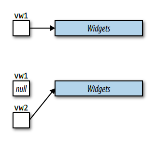

## 条款二十九：假定移动操作不存在，成本高，未被使用

**Item 29: Assume that move operations are not present, not cheap, and not used**

移动语义可以说是C++11最主要的特性。你可能会见过这些类似的描述“移动容器和拷贝指针一样开销小”， “拷贝临时对象现在如此高效，写代码避免这种情况简直就是过早优化”。这种情绪很容易理解。移动语义确实是这样重要的特性。它不仅允许编译器使用开销小的移动操作代替大开销的复制操作，而且默认这么做（当特定条件满足的时候）。以C++98的代码为基础，使用C++11重新编译你的代码，然后，哇，你的软件运行的更快了。

移动语义确实可以做这些事，这把这个特性封为一代传说。但是传说总有些夸大成分。这个条款的目的就是给你泼一瓢冷水，保持理智看待移动语义。

让我们从已知很多类型不支持移动操作开始这个过程。为了升级到C++11，C++98的很多标准库做了大修改，为很多类型提供了移动的能力，这些类型的移动实现比复制操作更快，并且对库的组件实现修改以利用移动操作。但是很有可能你工作中的代码没有完整地利用C++11。对于你的应用中（或者代码库中）的类型，没有适配C++11的部分，编译器即使支持移动语义也是无能为力的。的确，C++11倾向于为缺少移动操作的类生成它们，但是只有在没有声明复制操作，移动操作，或析构函数的类中才会生成移动操作（参考[Item17](../3.MovingToModernCpp/item17.md)）。数据成员或者某类型的基类禁止移动操作（比如通过delete移动操作，参考[Item11](../3.MovingToModernCpp/item11.md)），编译器不生成移动操作的支持。对于没有明确支持移动操作的类型，并且不符合编译器默认生成的条件的类，没有理由期望C++11会比C++98进行任何性能上的提升。

即使显式支持了移动操作，结果可能也没有你希望的那么好。比如，所有C++11的标准库容器都支持了移动操作，但是认为移动所有容器的开销都非常小是个错误。对于某些容器来说，压根就不存在开销小的方式来移动它所包含的内容。对另一些容器来说，容器的开销真正小的移动操作会有些容器元素不能满足的注意条件。

考虑一下`std::array`，这是C++11中的新容器。`std::array`本质上是具有STL接口的内置数组。这与其他标准容器将内容存储在堆内存不同。存储具体数据在堆内存的容器，本身只保存了指向堆内存中容器内容的指针（真正实现当然更复杂一些，但是基本逻辑就是这样）。这个指针的存在使得在常数时间移动整个容器成为可能，只需要从源容器拷贝保存指向容器内容的指针到目标容器，然后将源指针置为空指针就可以了：

```cpp
std::vector<Widget> vm1;

//把数据存进vw1
…

//把vw1移动到vw2。以常数时间运行。只有vw1和vw2中的指针被改变
auto vm2 = std::move(vm1);
```



`std::array`没有这种指针实现，数据就保存在`std::array`对象中：

```cpp
std::array<Widget, 10000> aw1;

//把数据存进aw1
…

//把aw1移动到aw2。以线性时间运行。aw1中所有元素被移动到aw2
auto aw2 = std::move(aw1);
```


注意`aw1`中的元素被**移动**到了`aw2`中。假定`Widget`类的移动操作比复制操作快，移动`Widget`的`std::array`就比复制要快。所以`std::array`确实支持移动操作。但是使用`std::array`的移动操作还是复制操作都将花费线性时间的开销，因为每个容器中的元素终归需要拷贝或移动一次，这与“移动一个容器就像操作几个指针一样方便”的含义相去甚远。

另一方面，`std::string`提供了常数时间的移动操作和线性时间的复制操作。这听起来移动比复制快多了，但是可能不一定。许多字符串的实现采用了小字符串优化（*small string optimization*，SSO）。“小”字符串（比如长度小于15个字符的）存储在了`std::string`的缓冲区中，并没有存储在堆内存，移动这种存储的字符串并不必复制操作更快。

SSO的动机是大量证据表明，短字符串是大量应用使用的习惯。使用内存缓冲区存储而不分配堆内存空间，是为了更好的效率。然而这种内存管理的效率导致移动的效率并不必复制操作高，即使一个半吊子程序员也能看出来对于这样的字符串，拷贝并不比移动慢。

即使对于支持快速移动操作的类型，某些看似可靠的移动操作最终也会导致复制。[Item14](../3.MovingToModernCpp/item14.md)解释了原因，标准库中的某些容器操作提供了强大的异常安全保证，确保依赖那些保证的C++98的代码在升级到C++11且仅当移动操作不会抛出异常，从而可能替换操作时，不会不可运行。结果就是，即使类提供了更具效率的移动操作，而且即使移动操作更合适（比如源对象是右值），编译器仍可能被迫使用复制操作，因为移动操作没有声明`noexcept`。

因此，存在几种情况，C++11的移动语义并无优势：

- **没有移动操作**：要移动的对象没有提供移动操作，所以移动的写法也会变成复制操作。
- **移动不会更快**：要移动的对象提供的移动操作并不比复制速度更快。
- **移动不可用**：进行移动的上下文要求移动操作不会抛出异常，但是该操作没有被声明为`noexcept`。

值得一提的是，还有另一个场景，会使得移动并没有那么有效率：

- **源对象是左值**：除了极少数的情况外（例如[Item25](../5.RRefMovSemPerfForw/item25.md)），只有右值可以作为移动操作的来源。

但是该条款的标题是假定移动操作不存在，成本高，未被使用。这就是通用代码中的典型情况，比如编写模板代码，因为你不清楚你处理的具体类型是什么。在这种情况下，你必须像出现移动语义之前那样，像在C++98里一样保守地去复制对象。“不稳定的”代码也是如此，即那些由于经常被修改导致类型特性变化的源代码。

但是，通常，你了解你代码里使用的类型，依赖他们的特性不变性（比如是否支持快速移动操作）。这种情况，你无需这个条款的假设，只需要查找所用类型的移动操作详细信息。如果类型提供了快速移动操作，并且在调用移动操作的上下文中使用对象，可以安全的使用快速移动操作替换复制操作。

**请记住：**

- 假定移动操作不存在，成本高，未被使用。
- 在已知的类型或者支持移动语义的代码中，就不需要上面的假设。
